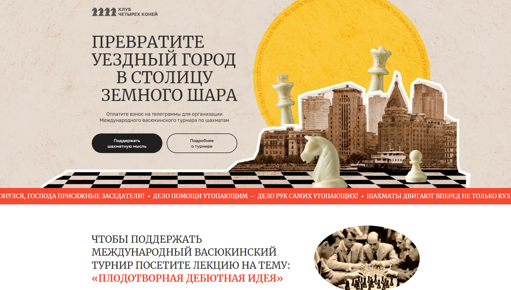

# Клуб четырёх коней – Адаптивный одностраничный лендинг

## О проекте

Проект представляет собой одностраничный адаптивный лендинг, выполненный по мотивам романа **«Двенадцать стульев»**. В центре сюжета — вымышленный **Международный васюкинский турнир по шахматам**, организованный гроссмейстером Остапом Бендером. Сайт демонстрирует современные подходы к вёрстке с акцентом на семантическую и адаптивную верстку, а также использование современных технологий и методологий.

Проект был выполнен в рамках **тестового задания**, и является отличным примером использования современных стандартов разработки.

## Превью проекта



## Ссылка на демо

- [Посмотреть сайт](https://chess-club-project.vercel.app/)

## Статус проекта

Проект завершён.

## Функциональность

- **Адаптивная вёрстка**: Поддержка корректного отображения на экранах от 340px до 1280px и выше.
- **Интерактивные элементы**: Включены слайдеры для отображения этапов турнира и участников.
- **Семантическая разметка**: Используются теги `<header>`, `<main>`, `<section>`, `<footer>`, `aria`-атрибуты для доступности.
- **Flexbox и Grid Layout**: Для построения сеток и позиционирования элементов.
- **Методология БЭМ**: Использована для именования классов с целью повышения читаемости и поддержки.
- **Оптимизация изображений**: Поддержка форматов `.webp`, а также адаптация изображений для Retina-дисплеев.
- **Кастомные анимации**: Включены уникальные анимации для улучшения пользовательского интерфейса.

## Технологии и инструменты

- **HTML5** — Семантическая разметка с доступностью.
- **CSS3** — Адаптивные стили с использованием Flexbox и Grid.
- **Flexbox и CSS Grid** — Гибкое построение макета.
- **Методология БЭМ** — Для структурированного и поддерживаемого кода.
- **Медиа-запросы** — Точки перелома: `1280px`, `1024px`, `768px`, `340px`.
- **JavaScript** — Модульная структура для функциональности сайта.
- **Оптимизация изображений** — Использование `.webp`, Retina-ready, сжатие для улучшенной производительности.

## Как запустить проект локально

1. Клонируйте репозиторий:

   ```bash
   git clone https://github.com/kirill-io/chess-club-project.git
   ```

2. Перейдите в папку проекта:

   ```bash
   cd chess-club-project
   ```

3. Откройте файл index.html в браузере или используйте расширение Live Server в редакторе кода (например, VS Code).
